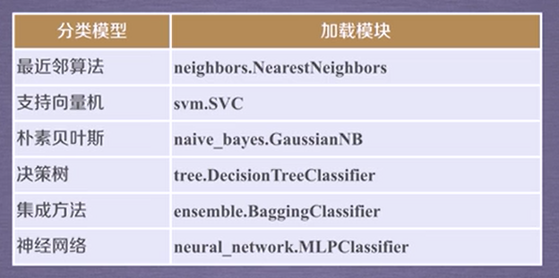

# sklearn库

## 一、sklearn库介绍

sklearn是一个基于Python的第三方模块，
它集成了一些常用的机器学习算法，在进行机器学习任务时，
并不需要实现算法，只需要简单的调用其中提供的模块就能完成大多数的任务。

## 二、sklearn库安装

**注意：** 需要事先安装Numpy、Scipy和matplotlib依赖库，因为sklearn库是在它们的基础上开发而成的。
* Numpy（Numerical Python）是一个开源的Python科学计算库
* Scipy库是sklearn库的基础，是基于Numpy的一个集成了多种数学算法和函数的Python模块
* metplotlib是基于Numpy的一套Python工具包，提供了大量的数据绘图工具

**参考下载地址：** http://www.lfd.uci.edu/~gohlke/pythonlibs/#

### 安装顺序
Numpy >>> Scipy >>> matplotlib >>> sklearn

### 安装方法（Windows系统）

1. cmd命令行进入到python所在目录

2. 依次输入以下命令进行安装

```
python -m pip install numpy
python -m pip install scipy
python -m pip install matplotlib
python -m pip install scikit-learn
```

3. cmd命令行进入到python，输入以下代码检测，如果能够成功引入则安装成功

```
import numpy
import matplotlib
import sklearn
```

## 三、sklearn标准数据集

### 数据集总览


### 数据集详细介绍

加载相关数据集 `from sklearn.datasets import load_数据集名称`

#### 1. 波士顿房价数据集 boston
包含506组数据，每条数据包含房屋及房屋周围的详细信息。
其中包括城镇犯罪率、一氧化氮浓度、住宅平均房间数等。
因此，波士顿房价数据集能够应用到 **回归** 问题上。

**重要参数**

**return_X_y** 若为True，则返回(data, target即价格)；
默认为False，只返回data即属性。

加载波士顿房价数据集【False】
```
from sklearn.datasets import load_boston
boston = load_boston()
print(boston.data.shape)
结果：(506, 13)
```
加载波士顿房价数据集【True】
```
from sklearn.datasets import load_boston
data, target = load_boston(return_X_y=True)
print(data.shape)
print(target.shape)
结果：(506, 13)
结果：(506)
```

#### 2. 鸢尾花数据集 iris
采集的是鸢尾花的测量数据及其所归属的类别。
测量数据包括：萼片长度、萼片宽度、花瓣长度、花瓣宽度。
类别分为Iris Setosa、Iris Versicolour、Iris Virginica。
该数据集可用于 **多分类** 问题。

**重要参数**

**return_X_y** 若为True，则以 **(data, target)** 形式返回数据；
默认为False，则以 **字典** 形式返回数据全部信息（包括data和target）。

#### 3. 手写数字数据集 digits
包括1797个0-9的手写数字数据，每个数字由8乘8大小的矩阵构成，
矩阵中值的范围是0-16，代表颜色的深度。

**重要参数**

**return_X_y** 若为True，则以 **(data, target)** 形式返回数据；
默认为False，则以 **字典** 形式返回数据全部信息（包括data和target）。

**n_class** 表示返回数据的类别数，如：n_class=5，则返回0到4的数据样本。

```
from sklearn.datasets import load_digits
digits = load_digits()
print(digits.data.shape)
结果：(1797, 64)
print(digits.target.shape)
结果：(1797,)
print(digits.images.shape)
结果：(1797, 8, 8)
```
利用matplotlib以图像形式展示
```
import matplotlib.pyplot as plt
plt.matshow(digits.images[0])
plt.show()
```
结果：


## 四、sklearn库的基本功能
### 分类任务

### 回归任务

### 聚类任务

### 降维任务

### 模型选择（本课程不涉及）
### 数据的预处理（本课程不涉及）
