# 无监督学习

## 一、基本概念

目标：利用**无标签**的数据学习数据的分布或数据与数据之间的关系。

应用：**聚类（clustering）**和**降维（Dimension Reduction）**

区别：无监督学习（数据无标签）Vs. 有监督学习（数据有标签）

## 二、聚类

定义：根据数据的 **“相似性”** 将数据分为多类的过程。

要点：评估 **“相似性”** 通常使用的方法就是计算两个样本之间的 **“距离”** ，不同的方法会影响聚类结果的好坏。

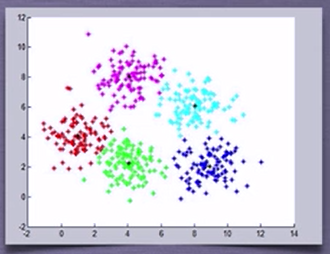

**常用距离计算方法：**

1. 欧式距离：源于欧式空间中两点的距离

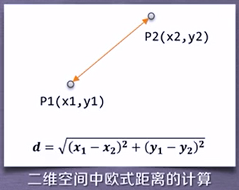

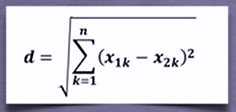

2. 曼哈顿距离（城市街区距离）：类似于从一个十字路口到另一个的距离

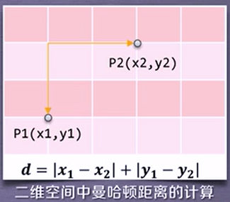

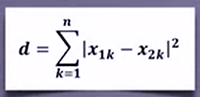

3. 马氏距离：表示数据的协方差距离，是一种尺度无关的度量方式；即先将样本点的各个属性标准化，再计算样本间的距离

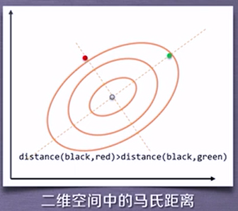

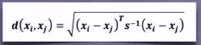

4. 夹角余弦：用向量空间中两个向量夹角的余弦值作为衡量差异大小；余弦值越接近1，表明两个向量越相似

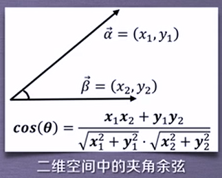

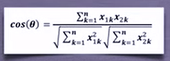

**sklearn中的聚类算法：**

sklearn提供的常用聚类算法函数在sklearn.cluster模块中，如：K-均值（K-mean）、近邻传播算法（AffinityPropagation）、DBSCAN...

*注意：以 **同样的数据集** 应用于 **不同的算法**， 可能会得到 **不同的结果和耗费时间** ，这是算法的特性决定的。*

**sklearn.cluster**

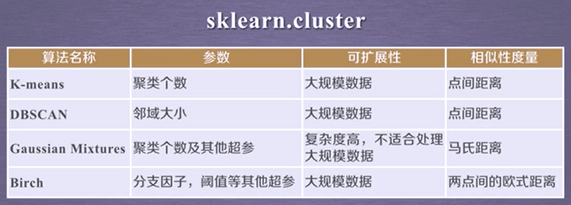

sklearn.cluster模块提供的各聚类算法函数可以使用**不同的数据形式**作为输入：

+ 标准数据： **[样本个数, 特征个数]** 定义的矩阵形式
+ 相似性矩阵：由 **[样本数目]** 定义的矩阵形式，矩阵中的每一个元素为两个样本的相似度，如DBSCAN和AffinityPropagation接受此种输入

## 三、降维

定义：在保证数据所具有的**代表性特性或分布**的情况下，将**高维**数据转化为**低维**数据的过程；也可以理解为对数据集的组成成分进行分解（decomposition）的过程。

用途：

+ 数据的可视化
+ 精简数据

*注意：降维和分类之间存在 **关联性** ，比如降维处理可以有助于某些高维数据的分类*

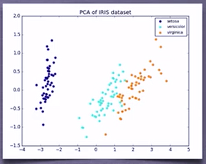

**sklearn中的降维算法：**

sklearn提供的常用聚类算法函数在sklearn.decomposition模块中，包含7种降维算法

**sklearn.decomposition**

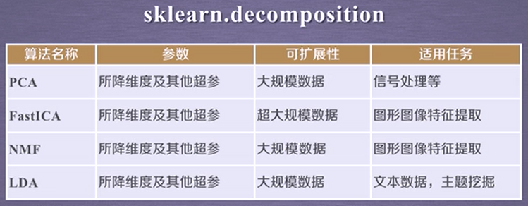

